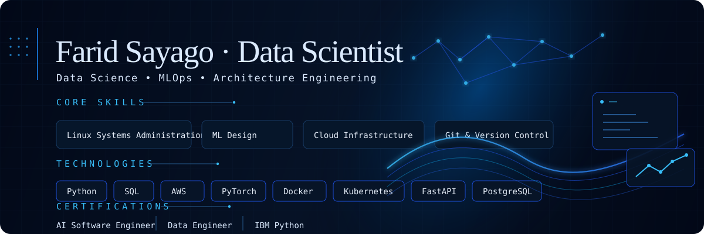

<!-- profile: Farid Sayago -->

<p align="center">
  
</p>

<p align="center">
  <a href="./README.md"></a>
  <a href="./README.es.md"></a>
</p>

<p align="center">
  
  
  
</p>

<p align="center">
  <a href="https://git.io/typing-svg">
    
  </a>
</p>

> [!NOTE]
> I use coding agents for UI polish, repetitive edits, and automation. I still own the architecture, reviews, and final code decisions. The target is boring in the best way: systems that work, make sense, and stay maintainable.

<h2><samp>⟩ ./profile --status</samp></h2>

```text
farid@github:~$ profilectl status

╭─ whoami ─────────────────────────────────────────────────────────────────────╮
│ name       Farid Sayago                                                       │
│ role       Data Scientist | Architecture Engineer | MLOps                     │
│ location   Bogota, Colombia                                                   │
│ status     Open to opportunities                                              │
│ tagline    I turn data, automation, and infrastructure into systems people use │
╰──────────────────────────────────────────────────────────────────────────────╯

╭─ current ────────────────────────────────────────────────────────────────────╮
│ Kimberly-Clark Professional / Business Insights Trainee                       │
│ Commercial insights, BI dashboards, automated pipelines, and AI workflows.     │
╰──────────────────────────────────────────────────────────────────────────────╯

╭─ focus ──────────────────────────────────────────────────────────────────────╮
│ Data science with Python, SQL, Pandas, and Power BI                           │
│ ETL pipelines, OLAP reporting, and dashboard automation                        │
│ Machine learning systems, model deployment, and MLOps                          │
│ Self-hosted infrastructure, Kubernetes, containers, and cloud tooling           │
│ Readable architecture that keeps projects maintainable                         │
╰──────────────────────────────────────────────────────────────────────────────╯

╭─ impact ─────────────────────────────────────────────────────────────────────╮
│ Saved 40+ hours per month by automating manual reporting                      │
│ Built reporting workflows for operations across 14 countries                   │
│ Processed 24M+ rows in applied econometric research                            │
│ Turned messy business data into dashboards people actually used                │
╰──────────────────────────────────────────────────────────────────────────────╯

╭─ certifications ─────────────────────────────────────────────────────────────╮
│ Data Engineer | IBM Python | Data Scientist                                   │
│ AI Software Engineer | Data Analysis and Visualization                         │
╰──────────────────────────────────────────────────────────────────────────────╯
```

<h2><samp>⟩ ./stack --list</samp></h2>

<div align="center">

<h4><samp>// data science & analytics</samp></h4>


<h4><samp>// ai, ml & model work</samp></h4>


<h4><samp>// systems, mlops & cloud</samp></h4>


<h4><samp>// daily environment</samp></h4>


</div>

<h2><samp>⟩ ./projects --active</samp></h2>

```text
farid@github:~$ tree ./projects --depth=1

./projects
├── wiener-API        RESTful CRUD backend: auth, media, CDN        [WIP]
│   └── FastAPI, SQLAlchemy, JWT, ImageKit
├── wiener-snake      Snake AI with reinforcement learning          [DONE]
│   └── PyTorch, Pygame, CPU-only RL
├── Wiener-git        Git clone built from scratch                  [WIP]
│   └── Python
├── wiener-tickets    Full MLOps data science pipeline              [TODO]
│   └── Stack in design
└── whttp             HTTP server from scratch                      [TODO]
    └── C
```

<h2><samp>⟩ ./stats --github</samp></h2>

<p align="center">
  
  
</p>

<p align="center">
  
</p>

<h2><samp>⟩ ./contact --public</samp></h2>

<p align="center">
  <a href="https://www.linkedin.com/in/faridsayago/"></a>
  <a href="https://sayagos.tech/"></a>
</p>

```text
farid@github:~$ echo "Make knowledge usable. Then make it reliable."
```

<p align="center">
  
</p>

<p align="center">
  <sub><samp>Built on Arch Linux, btw. ;) | <a href="https://github.com/Faridsz0605">Faridsz0605</a></samp></sub>
</p>
